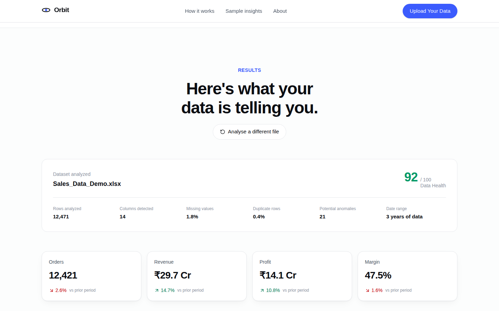
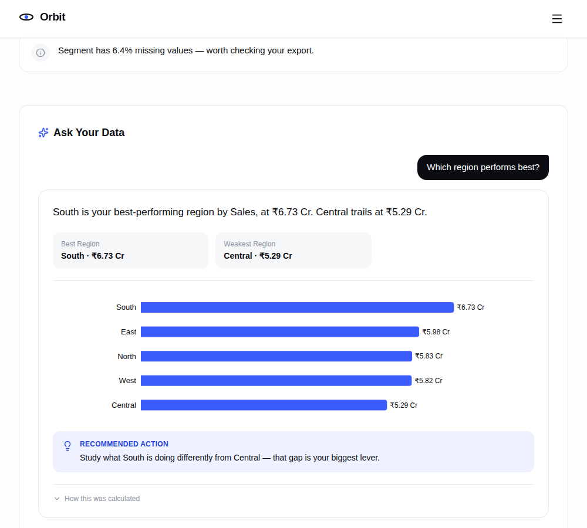

# Orbit

**Upload your Excel or CSV. Get instant dashboards, insights and AI-powered answers.** Not a fixed demo you click through — a real analysis engine that reads whatever spreadsheet you give it, detects what's in it, and builds the dashboard from that.

> Turn Your Data Into Decisions.


## How it works

1. **Upload** — drag & drop a `.xlsx`/`.xls`/`.csv` file, or click **Try Sample Data** to use a bundled example (no file needed).
2. **Analyze** — the backend detects your columns (which one is a date, which are regions/categories/products, which are revenue/cost/quantity measures), scores data quality, and flags statistical anomalies.
3. **Visualize** — KPIs and charts are generated from *your* columns. A dataset with `Region`/`City` gets a geography breakdown; one with `Category` gets a category split; a `Product`/`Customer`/`Manager` column gets a top-N ranking. None of it is hardcoded to one dataset's schema.
4. **Ask** — a plain-language question ("Why did sales decline?", "Which region performs best?", "What are my top products?", "What should I investigate?") gets answered with the real numbers behind it, not a guess.





## Architecture

```
React (Vite)  →  FastAPI  →  pandas analysis engine  →  Result
                                      ↓
                        AI explanation (only for "Ask Your Data")
```

**No database.** Every request — `/api/data/analyze` and `/api/data/ask` — re-parses the uploaded file (or regenerates the bundled sample) from scratch and computes everything with pandas. That's a deliberate choice, not a limitation: it means there's no session state to lose when a free-tier instance restarts, no Postgres to provision, and no risk of the AI model inventing a number — every KPI, chart value and insight is computed deterministically before the AI provider ever sees it. The provider's only job is to phrase a sentence around numbers that already exist. See [`backend/app/services/data_analysis_service.py`](backend/app/services/data_analysis_service.py) (the engine) and [`ai_service.py`](backend/app/services/ai_service.py) (intent detection + orchestration for "Ask Your Data").

The AI provider is swappable without touching any route or service code:

```
AIService
  ├── DemoProvider    (default — deterministic templates, zero cost, zero API key)
  └── GeminiProvider  (AI_MODE=live — calls Gemini's free tier, falls back to DemoProvider on any failure)
```

**Frontend**
```
frontend/
  src/
    components/
      upload/       # UploadPanel (drag & drop + sample), ProcessingSequence (animated steps)
      results/      # ResultsSection, HealthCard, ChartRenderer, InsightsList
      ai/           # AIChat, AIResponseCard — "Ask Your Data"
      charts/       # generic chart primitives (trend/bar/donut), unit-aware formatting
      hero/, sections/, layout/, ui/
    pages/Home.jsx  # owns the upload → analysis → results state
    services/
      dataService.js  # multipart calls to /api/data/analyze and /api/data/ask
    config/brand.js   # change BRAND_NAME here to re-skin the whole site
```

**Backend**
```
backend/
  app/
    main.py                          # FastAPI app, CORS, rate-limit middleware
    api/routes/
      data.py                        # POST /api/data/analyze, POST /api/data/ask
      health.py
    services/
      data_analysis_service.py       # column-role detection, health score, KPIs,
                                      # chart generation, insight generation — the engine
      ai_service.py                  # intent detection + context-building for "Ask Your Data"
      providers/                     # base.py, demo_provider.py, gemini_provider.py
      rate_limiter.py                # in-memory daily AI limit + short-lived answer cache
    data/sample_sales_data.csv       # bundled "Try Sample Data" dataset (~12.5K realistic rows)
  scripts/generate_sample_data.py    # regenerates the sample dataset from scratch
```

## Local Development

### Frontend

```bash
cd frontend
npm install
npm run dev          # http://localhost:5173
```

### Backend

No database required.

```bash
cd backend
python3 -m venv .venv && source .venv/bin/activate
pip install -r requirements.txt
cp .env.example .env

uvicorn app.main:app --reload --port 8000
```

Point the frontend at it with `VITE_API_BASE_URL` (defaults to `/api`, proxied to `localhost:8000` in dev — see `frontend/vite.config.js`).

To regenerate the bundled sample dataset (`app/data/sample_sales_data.csv`):

```bash
python scripts/generate_sample_data.py
```

### Environment variables

**Backend** (`backend/.env`, see `backend/.env.example`):

| Variable | Default | Purpose |
|---|---|---|
| `AI_MODE` | `demo` | `demo` (free, deterministic) or `live` (calls Gemini) |
| `GEMINI_API_KEY` | — | required for `AI_MODE=live` |
| `AI_DAILY_LIMIT` | `5` | "Ask Your Data" questions per client per day |
| `AI_MAX_PROMPT_LENGTH` | `300` | max question length |
| `AI_REQUEST_TIMEOUT_SECONDS` | `15` | timeout for the AI provider call |
| `CORS_ALLOWED_ORIGINS` | localhost | comma-separated allowed frontend origins |
| `MAX_REQUEST_BODY_BYTES` | 10MB | request body cap (uploads are separately capped at 8MB in `api/routes/data.py`) |
| `BRAND_NAME` | `Orbit` | change once, the API identity follows |

**Frontend** (`frontend/.env`, optional):

| Variable | Default | Purpose |
|---|---|---|
| `VITE_API_BASE_URL` | `/api` | backend base URL |
| `VITE_BRAND_NAME` | `Orbit` | change once, the whole site follows (see `src/config/brand.js`) |

Never commit `.env`. Only `.env.example` files are tracked.

## Deployment (free tier, $0/month)

Two services, both with permanent free tiers and no credit card: **Render** (FastAPI, via the [`render.yaml`](render.yaml) blueprint in this repo) and **Vercel** (frontend, via [`frontend/vercel.json`](frontend/vercel.json) for SPA routing). No database needed.

1. **Backend — [render.com](https://render.com)**
   New → Blueprint → connect this repo. Render reads `render.yaml` and configures the service automatically. `GEMINI_API_KEY` and `CORS_ALLOWED_ORIGINS` are left out of the blueprint on purpose — set them in the dashboard (Gemini's key is optional, only needed for `AI_MODE=live`; leave `CORS_ALLOWED_ORIGINS` blank for now, come back after step 2).

   Deploy, then note the resulting URL (`https://orbit-api-xxxx.onrender.com`).

2. **Frontend — [vercel.com](https://vercel.com)**
   New Project → import this repo → set **Root Directory** to `frontend`. Add an environment variable `VITE_API_BASE_URL` = `https://orbit-api-xxxx.onrender.com/api` (your Render URL from step 1, with `/api` appended). Deploy, then note the resulting URL.

3. **Close the loop** — back in Render, set `CORS_ALLOWED_ORIGINS` to your Vercel URL from step 2 and save (triggers a redeploy).

4. **Keep the backend warm (optional but recommended)** — Render's free tier sleeps after 15 minutes idle, giving the first visitor after a quiet spell a 30-60s wait. This repo includes [`.github/workflows/keep-alive.yml`](.github/workflows/keep-alive.yml), which pings `/health` every 10 minutes. Add a repository secret named `BACKEND_HEALTH_URL` (Settings → Secrets and variables → Actions) set to `https://orbit-api-xxxx.onrender.com/health` and it starts working immediately — no code change needed. (GitHub Actions minutes are unlimited on public repos.)

> **Already have a Neon Postgres database from an earlier version of this project?** It's no longer used — this build has no database dependency. You can delete the `DATABASE_URL` environment variable from your Render service, and delete or pause the Neon project, with no effect on the site.

## Demo Mode / Live AI Mode

- **`AI_MODE=demo`** (default): the analysis engine (KPIs, charts, insights) is always real, computed from the actual uploaded data. "Ask Your Data" answers are phrased with a deterministic template instead of calling an external model. No API key needed.
- **`AI_MODE=live`**: the same computed numbers are handed to Gemini's free tier to phrase more naturally. If that call fails for any reason (quota, network, invalid key), it transparently falls back to the demo template rather than breaking the response.

This is why the live site can sit on a free-tier host indefinitely without an AI bill.

## Security & abuse safeguards

- Server-side only API keys — never exposed to the frontend, never called directly from the browser.
- Per-client daily AI question limit (`AI_DAILY_LIMIT`), plus a general per-IP request-rate limiter.
- Uploaded files are capped at 8MB and validated by extension and content before parsing; unreadable or empty files return a clear error instead of a crash.
- Maximum prompt/response length and request timeout on every AI call.
- Short-lived answer cache, keyed by the specific dataset's content hash plus the question — so repeated questions don't re-invoke the AI provider, and a cached answer for one file is never served for a different one.
- The AI layer only ever explains numbers `data_analysis_service.py` already computed with pandas — it never computes or invents a number itself.
- CORS allowlist, request body size limit, and a generic error response for unhandled exceptions (real errors are logged server-side, never shown to the user).

## Tech stack

React · Vite · Tailwind CSS · Recharts · Framer Motion · FastAPI · Python/Pandas · Gemini API

## License

MIT
