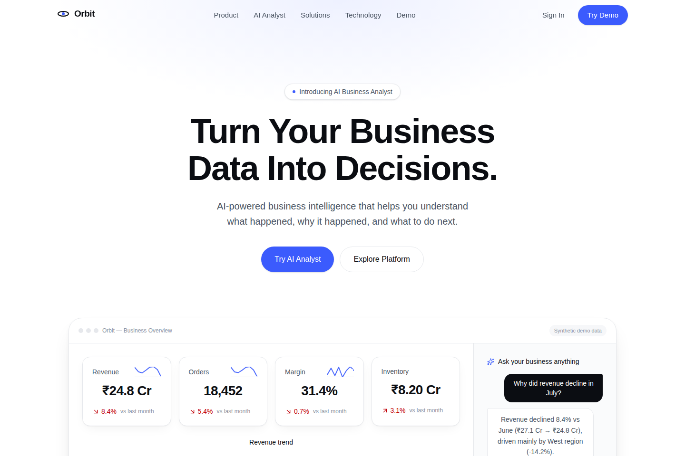
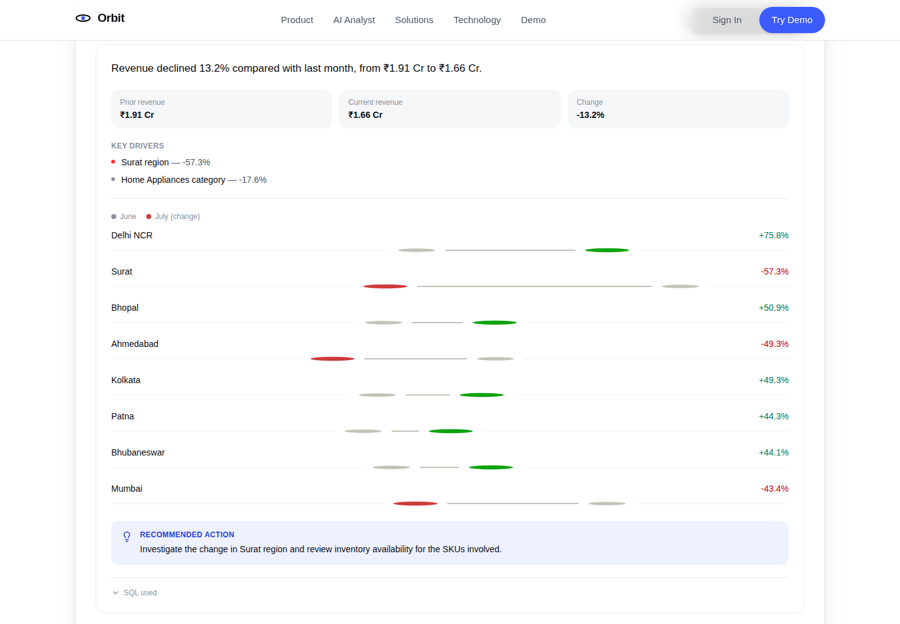
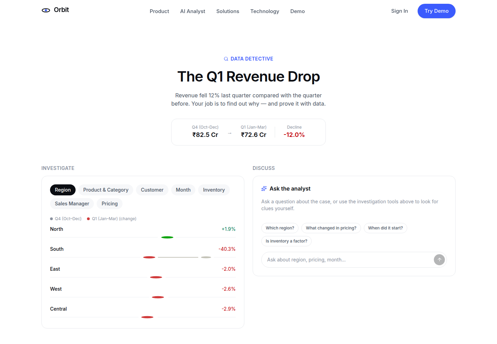

# Orbit

**AI-powered business intelligence.** Ask a question in plain language, get an answer backed by real numbers — not a chatbot bolted onto a dashboard, an analyst that explains what happened, why, and what to do next.

> Turn Your Business Data Into Decisions.



## Features

- **AI Business Analyst** — ask about revenue, regions, products, inventory or sales targets in natural language and get a data-backed answer with drivers, a chart, and a recommendation.
- **Sales Intelligence** — a full dashboard (revenue trend, regional performance, top products, target vs actual) driven by realistic synthetic data.
- **Inventory Intelligence** — ageing analysis, stock-by-category, and a risk table flagging SKUs that need attention.
- **Data Detective** — an interactive investigation game: revenue dropped, find out why, using the same tools a real analyst would.
- **Natural-language analytics** — the AI layer explains numbers that were already computed by SQL; it never generates the numbers itself (see [Architecture](#architecture)).
- **Works with zero infrastructure** — no backend deployed, no API key, no database? The site still works. See [Demo Mode](#demo-mode--live-ai-mode).





## Architecture

```
React (Vite)  →  FastAPI  →  Intent detection  →  SQL (Postgres)  →  Result
                                                          ↓
                                              AI explanation (only when needed)
```

The core cost-control principle: **most questions never touch an AI model.** A question like "which region is performing best?" is answered by running a parameterized SQL query and formatting the result — the AI provider is only asked to phrase a sentence around numbers that already exist. See [`backend/app/services/ai_service.py`](backend/app/services/ai_service.py).

The AI provider itself is swappable without touching any route or service code:

```
AIService
  ├── DemoProvider    (default — deterministic templates, zero cost, zero API key)
  └── GeminiProvider  (AI_MODE=live — calls Gemini's free tier, falls back to DemoProvider on any failure)
```

**Frontend**
```
frontend/
  src/
    components/   # Navbar, Hero, dashboard, charts, ai/, detective/, sections/
    pages/        # Home, Analyst, DataDetective, Inventory, Demo
    services/     # api.js, aiService.js — talks to the backend, falls back to
                  # a local demo engine (data/aiResponses.js) if it's unreachable
    data/         # hand-tuned synthetic dataset used by the local fallback
    config/brand.js  # change BRAND_NAME here to re-skin the whole site
```

**Backend**
```
backend/
  app/
    main.py               # FastAPI app, CORS, rate-limit middleware
    api/routes/           # health, ai, analytics, inventory
    services/
      sql_service.py      # every analytical query — parameterized, read-only
      ai_service.py        # intent detection + orchestration
      providers/           # base.py, demo_provider.py, gemini_provider.py
      rate_limiter.py      # daily AI limit + short-lived answer cache
    models/db_models.py    # SQLAlchemy models
    database/seed.py       # synthetic data generator (configurable scale)
```

## Screenshots

| | |
|---|---|
| Landing hero |  |
| AI Analyst |  |
| Data Detective |  |

## Local Development

### Frontend

```bash
cd frontend
npm install
npm run dev          # http://localhost:5173
```

The frontend works standalone — with no backend running, the AI Analyst and Data Detective fall back to a local demo engine built from realistic, internally-consistent synthetic data (`src/data/`).

### Backend

Requires PostgreSQL 14+ (a local install, or `docker run -e POSTGRES_USER=orbit -e POSTGRES_PASSWORD=orbit -e POSTGRES_DB=orbit -p 5432:5432 postgres:16-alpine`).

```bash
cd backend
python3 -m venv .venv && source .venv/bin/activate
pip install -r requirements.txt
cp .env.example .env               # edit DATABASE_URL if needed

python -m app.database.seed --scale small   # seeds in seconds; see below for scale options
uvicorn app.main:app --reload --port 8000
```

Point the frontend at it with `VITE_API_BASE_URL` (defaults to `/api`, proxied to `localhost:8000` in dev — see `frontend/vite.config.js`).

#### Seed data scale

The generator produces a realistic, internally-correlated dataset — sales vary by region, month, category and season; specific products are intentionally declining, stocked out, or ageing in inventory; sales targets are set from trailing performance so some managers genuinely miss them once a regional demand shock hits.

```bash
python -m app.database.seed --scale small   # ~35K sale lines, seeds in seconds — default for local dev
python -m app.database.seed --scale demo    # a fuller demo dataset
python -m app.database.seed --scale full    # ~spec scale: 50K customers, 5K products, 3 years — slow, needs a real machine
```

Or override any dimension directly: `python -m app.database.seed --customers 50000 --products 5000 --months 36`.

### Environment variables

**Backend** (`backend/.env`, see `backend/.env.example`):

| Variable | Default | Purpose |
|---|---|---|
| `DATABASE_URL` | — | PostgreSQL connection string |
| `AI_MODE` | `demo` | `demo` (free, deterministic) or `live` (calls Gemini) |
| `GEMINI_API_KEY` | — | required for `AI_MODE=live` |
| `AI_DAILY_LIMIT` | `5` | AI questions per client per day |
| `AI_MAX_PROMPT_LENGTH` | `300` | max question length |
| `AI_REQUEST_TIMEOUT_SECONDS` | `15` | timeout for the AI provider call |
| `CORS_ALLOWED_ORIGINS` | localhost | comma-separated allowed frontend origins |
| `BRAND_NAME` | `Orbit` | change once, the API identity follows |

**Frontend** (`frontend/.env`, optional):

| Variable | Default | Purpose |
|---|---|---|
| `VITE_API_BASE_URL` | `/api` | backend base URL |
| `VITE_BRAND_NAME` | `Orbit` | change once, the whole site follows (see `src/config/brand.js`) |
| `VITE_AI_DAILY_LIMIT` | `5` | shown on the pricing section — keep in sync with the backend |

Never commit `.env`. Only `.env.example` files are tracked.

## Demo Mode / Live AI Mode

The whole point of this project is that it demonstrates real capability without costing anything to run publicly:

- **`AI_MODE=demo`** (default): the backend still runs real SQL against Postgres — the AI layer just phrases the answer with a deterministic template instead of calling an external model. No API key needed.
- **`AI_MODE=live`**: the same SQL results are handed to Gemini's free tier to phrase more naturally. If that call fails for any reason (quota, network, invalid key), it transparently falls back to the demo template rather than breaking the response.
- **No backend at all**: the frontend's `aiService.js` tries the backend first and, if it's unreachable, falls back to a local, hand-tuned demo dataset — so the public site keeps working even if the API isn't deployed.

This is why the live site can sit on a free-tier host indefinitely without an AI bill.

## Security & abuse safeguards

- Server-side only API keys — never exposed to the frontend, never called directly from the browser.
- Per-client daily AI question limit (`AI_DAILY_LIMIT`), plus a general per-IP request-rate limiter.
- Maximum prompt/response length and request timeout on every AI call.
- Short-lived answer cache so repeated questions (e.g. the suggested-question chips) don't re-invoke the AI provider.
- All analytical SQL is fixed and parameterized — the AI layer only ever explains query results, it never constructs or executes SQL itself, so there is no SQL-injection surface from AI input.
- CORS allowlist, request body size limit, and a generic error response for unhandled exceptions (real errors are logged server-side, never shown to the user).

## Tech stack

React · Vite · Tailwind CSS · Recharts · Framer Motion · FastAPI · SQLAlchemy · PostgreSQL · Python/Pandas · Gemini API

## License

MIT
